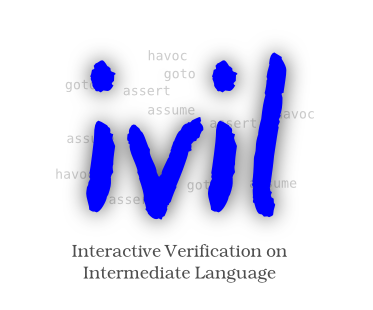

# Interactive Verifier for an Intermediate Language

ivil is a tool for the interactive (better semi-automatic) verification on the level of an intermediate verification language.

*This is a proof-of-concept implementation. Current Version: 0.20*

The verification language which is used in ivil is embedded into a special
[dynamic logic](http://www.wisdom.weizmann.ac.il/%7Edharel/papers/DynamicLogic.ps). 
It is closely related - yet not entirely identical - 
to [BoogiePL](http://research.microsoft.com/en-us/um/people/leino/papers/krml178.pdf)
and is unstructured, indeterministic, and side-effect-free. Its basic statements are:

*    assertions (`assert phi`)
*    assumptions (`assume phi`)
*    anonymisations (`havoc x`)
*    assignments (`x := t`)
*    indeterministic branching (`goto n1 n2`)

ivil can translate proof obligations to [SMTLib](http://goedel.cs.uiowa.edu/smtlib/) input.
The result of SMT solvers (such as [Z3](http://research.microsoft.com/en-us/um/redmond/projects/z3/))
can be used to close subgoals in ivil.

The Java Webstart Technology can be used to launch ivil.

The project page is http://i12www.ira.uka.de/~mulbrich/ivil/
